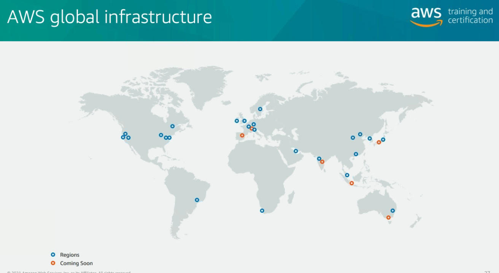

# Aula 1

## Pausas
- Intervalo 9h30 ~ 9h45 (UTC)
- Intervalo 15h30 ~ 15h45 (UTC)
- Almoço 12h ~ 13h20 (UTC)
  
## Material

## Introdução ao AWS

- Introdução ao cloud
- Cenários de cloud
- Overview da infraestrutura
- Introdução ao AWS Foundation Services
- Wrap-Up

### Cloud Computing
- IaaS - Infraestructure as a service - rodar a infraestrutura sem gerenciá-la (EC2, por exemplo)
- PaaS - Platform as a service - rodar aplicações sem gerenciar a infraestrutura (RDS, por exemplo)
- SaaS - software as service (Lamnda, por exemplo)
- Parar de pensar a infraestrutura como hardware, e sim pensar nela como um software (seviço). 

#### Benefícios

  

- Não é necessário administrar um datacenter
- Pensar na aplicação, e só
- "o servidor não tá dimensionado direitinho...", rapidamente modificável
- Despezas variáveis
- On demand
- Maior utilizações, Menor preço (massive economies of scale)
- Elasticidade
- Agilidade de recursos
- Ubiquidade

### Service Stack

  

- Serviços de Computação
  - EC2
- Serviços de Networking
  - VPC
  - Route 53
- Serviços de Armazenamento
  - S3 - armazenamento de objetos.
  - S3 Glacier - o mesmo que o S3, só que baseado em long-term-storage.
  - EBS - dimensionamento de disco, escolhendo com throughput otimizado, etc.
  - EFS - totalmente gerenciado para compartilhamento de arquivos, não é necessário dimensionar, ele é autoescalável, escolher zona de disponibilidade, várias instâncias concorrentes. (petabytes)
- Serviços de Gerenciamento
  - CloudWatch - monitoramento e observação criado para engenheiros de DevOps
  - CloudTrail - "Dedo duro", registra todas as chamadas de API dentro da conta
  - CloudFormation - IaC

#### Serviços gerenciados vs Não Gerenciados

##### Não Gerenciados
- Você gerencia somente a escala, a tolerância a falha e a disponibilidade, mas não o hardware.
  - EC2

##### Gerenciados
- Não é gerenciada a escala, tolerância, nem disponibilidade, são geralmente construidos em um serviço
  - DB

#### Cenários de Núvem

- All-In cloud
- Hybrid

#### Microsserviços

  

- Agilidade - Features específicas por ms (arquitetura mais rápida em ms específico)
- Escalabilidade flexível - não é necessário pensar em escalar monolito, somente o MS (lei de ahmdal)
- Liberdade Tecnológica - Não é necessário que outro ms conheça outro, somente a interface de comunicação entre eles
- Código reutilizável
- Resiliência (isolation)
- Deploy fácil

##### Melhores práticas
- Trocar os componentes sem quebrá-los
  - A interface de comunicação é um contrato (tipo o gRPC ou Ethereum)
  - Cada um dos microsserviços é dono de seu processo

- Usar uma API simples
  - Diminui o custo de usar o serviço
  - É possível esconder os detalhes

- Tratar como stateless (não armazenar informações nem dados de sessão)

##### Desacoplamento
- Orientado a eventos
  - AWS Lambda - Responde a eventos da infraestrutura AWS (event driven, reactive)

- Orientado a serviços
  - gRPC
  - HTTP
  - Kafka
  - SQS
  - RabbitMQ

   

### Arquitetura AWS

  

[AWS GCI](https://apps.kaonadn.net/5181491956940800/index.html)

  - AZ (Availability Zone)
    - Um ou mais datacenters
    - Arquiteturado para existir isolamento de falha (falha uma AZ, as outras não são afetadas)
    - Interconectadas com outras AZs usando links de altíssima velocidade
  - Regions
    - Localizações geográficas
    - Duas ou mais AZs
