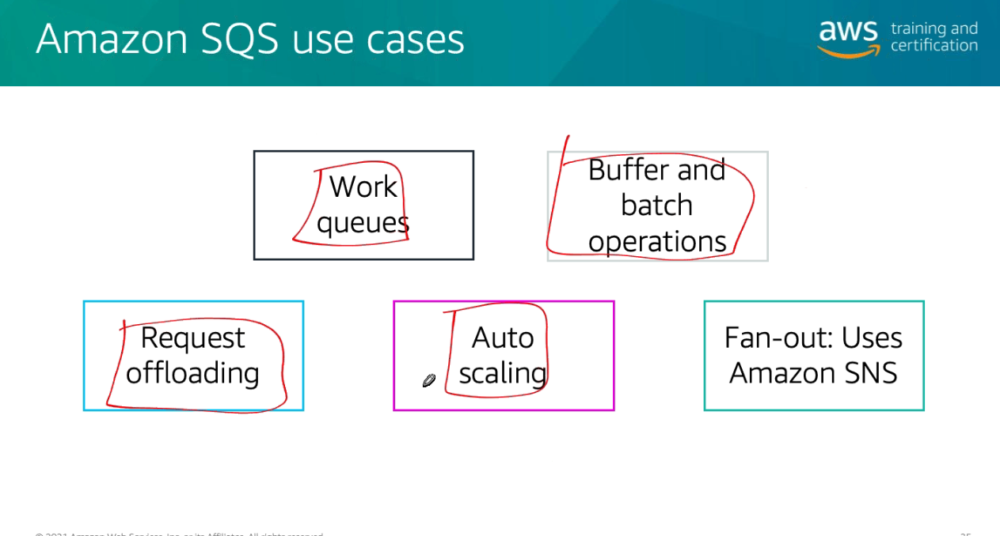
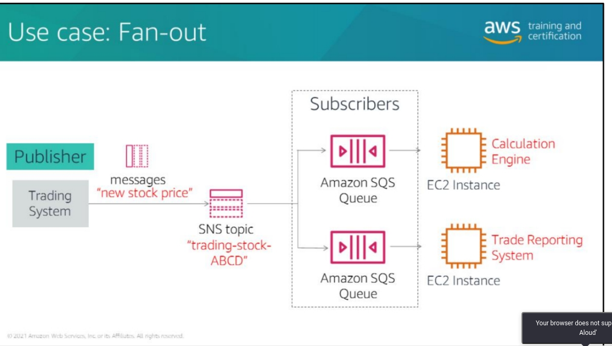
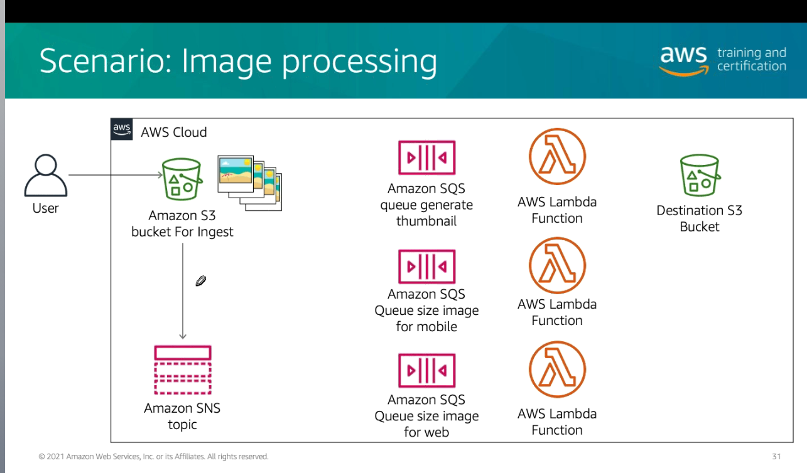
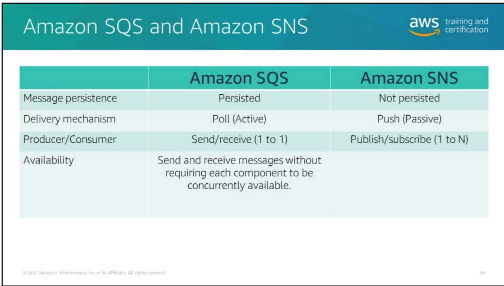
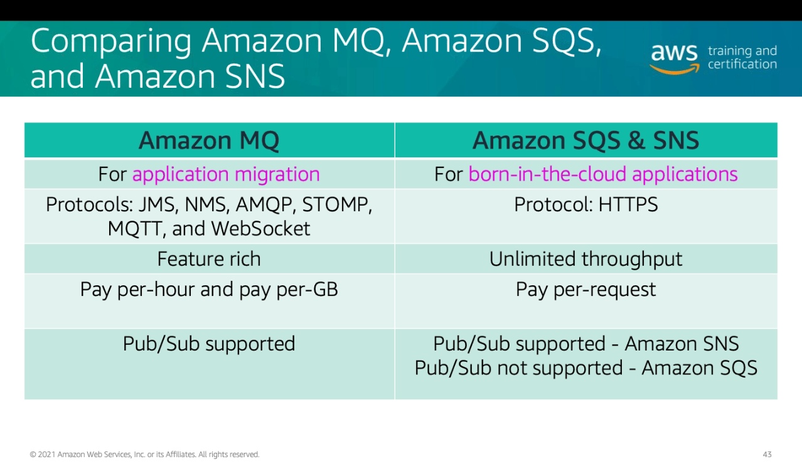

# Módulo 10

## Amazon SQS
- Consumidor não pode processar todas as requisições de uma vez
- Gargalo
- Desacoplamento do consumidor e produtor

### Ciclo de Vida
- Insertion
  - Wait Time (ttl)
  - Número de mensagens recebidas
- Deletion
  - Deleção chamada pelo consumidor

### Operações
- Criar Fila
- Estipular atributos da fila
- Recuperar atributos da fila
- Recuperar URI da fila
- Listar filas
- deletar fila

### Dead Letter Queue
- Fila de mensagens que não consegui processar

### Casos de Uso

  

## Amazon SNS
- Tópicos
  - AWS Lambda
  - SQS
  - HTTP
  - Email
  - SMS
  - Mobile (Push Notifications)
- Subject pode ser usado para filtros
- Os tópicos precisam ser criados antes da utilização  
  - Diferente do kafka, que os tópicos podem ser criados on-the-fly

### Operações
 - CreateTopic
 - Subscribe
 - DeleteTopic
 - Publish

### Caso de Uso

  

  

### Comparativo entre SQS e SNS

  

## Amazon MQ
- Broker gerenciado de messagens para Apache MQ
    - JMS
    - AMQP
    - STOMP
    - MQTT

### MQ, SQS e SNS

  
