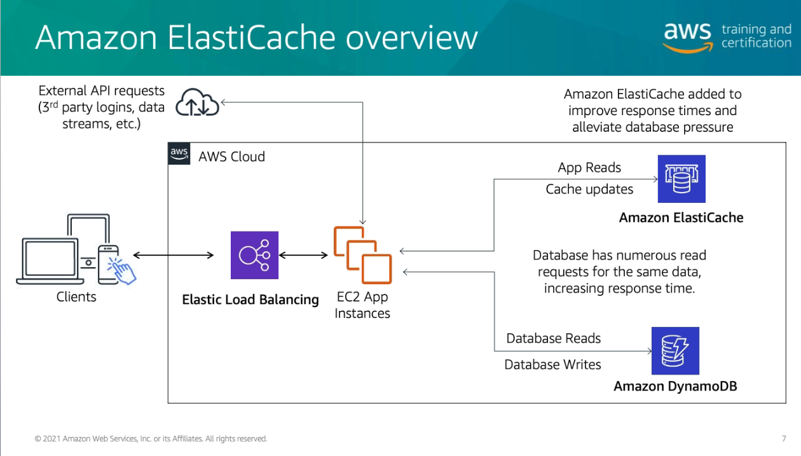
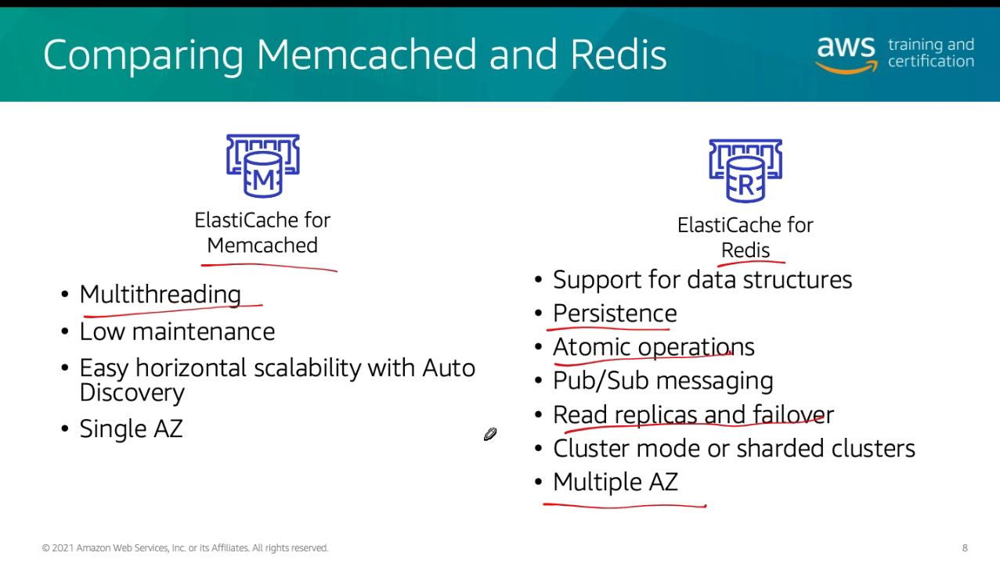

# Módulo 11

## Caching

- Melhorar a velocidade da aplicação
- Reduz a latência das respostas
- Aliviar a carga de queries demoradas
- Provê um enorme ganho de performance

### Quando utilizar
-  Data requer uma operação lenta ao ser adquiridos (SAP :P)
-  Dados relativamente estáticos e frequentemente acessados (perfil de rede social)
-  Informações que podem ficar antigas por algum tempo (previsão climática)

## Amazon ElastiCache

  

### Memcached vs Redis

  

- Cache miss
  - Tentou encontrar no cache e não encontrou, busca no banco
- Cache hit
  - Encontrou no cache

### Caching strategies

#### Lazy Load
- Trabalha em cima do cache miss
- Lê da aplicação, entrega para o usuário, e escreve no cache
- Pode trazer dados antigos

#### Write Through
- Escreve no banco, escreve na cache
- Penalidade na escrita