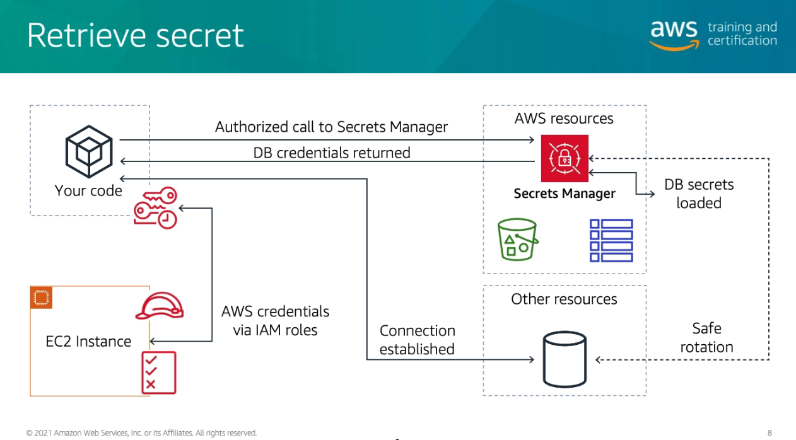
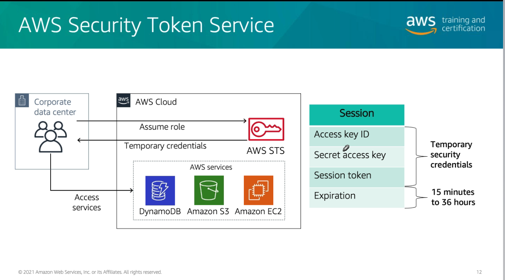

# Módulo 12

## Desafios de certificados SSL
- Custo
- Renovação de certificados
- Gerenciamento de chave de segurança
- Onde ele está sendo usado?

## AWS Certificates Manager
- Gerenciador de certificados
- Somente taxa da CA

## AWS Secrets Manager
- Armazena, rotaciona e recupera credenciais
- Armazena em escala
- Auditar e monitorar uso de recursos secretos
- Evitar lidar com secrets na aplicação

  

## AWS Security Token Service
- Provém credenciais de usuário temporárias e confiáveis
- Configurar o tempo min/max de credenciais

  

## AWS Cognito
- Possibilita salvar e sincronizar dados de usuários entre diferentes devices
- Possibilita acesso ao AWS Cloud usando vários federations
  - AWS
  - Facebook
  - Twitter
  - Google
  - Apple
  - Qualquer OpenID