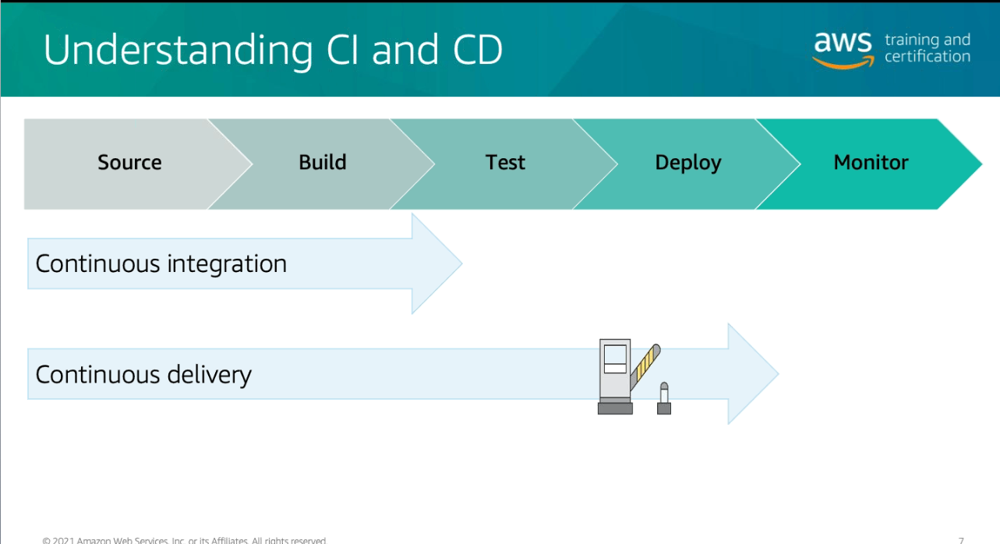

# Módulo 13

## DevOps
- Filosofia cultural de compartilhamento de responsabilidade
- Visibilidade e comunicação entre a equipe como um todo
- Microsserviços
- CI/CD

## CI/CD
- Processo de construção de software
 

## AWS Code Services