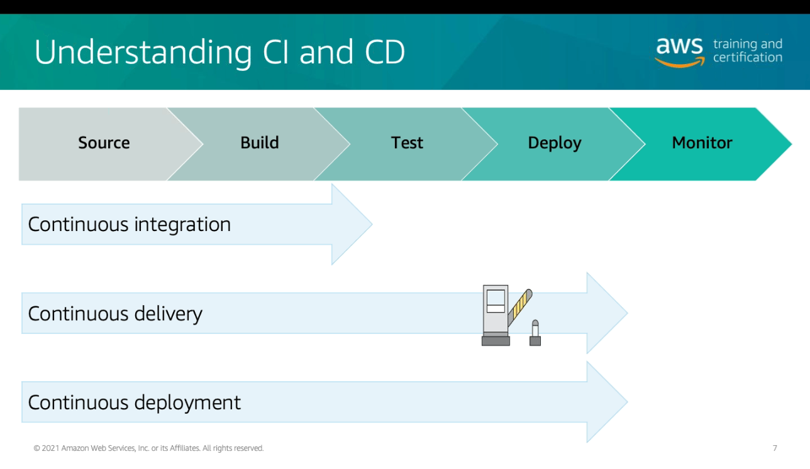

# Módulo 13

## DevOps
- Filosofia cultural de compartilhamento de responsabilidade
- Visibilidade e comunicação entre a equipe como um todo
- Microsserviços
- CI/CD

## CI/CD
- Processo de construção de software
  

- IaaC
  - Todos os recursos para rodar a aplicação disponíveis e configuradas
    - Infraestrutura

## AWS Code Services

  

- AWS CodeCommit
  - Repositório centralizado
  - Escalável
- AWS CodeBuild
  - Gera um servidor de build (Servless)
  - Build Spec 
    - Parametrizar todo o processo de construção 
    - Instalar dependências
- AWS CodePipeline
  - Criar uma esteira CI/CD de forma interativa, visual e centralizada
  - Controlar as etapas do processo, transição, ações em paralelo entre as etapas
  - Notificação quando é necessário aprovação manual
  - Notificação quando é encontrado um erro
- AWS CodeStar
  - Ferramenta de gerenciamento de projeto
  - Todos os outros centralizados em um dashboard
- AWS CodeDeploy
  - Implementar o artefato no servidor (deploy)
  - Hooks
    - Testar antes de implementar
    - 