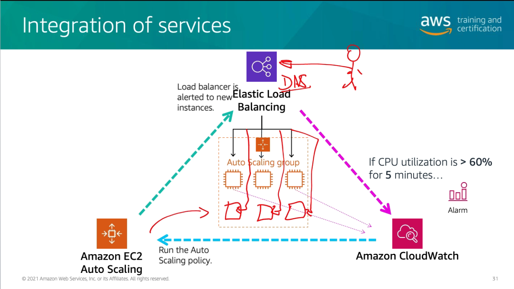
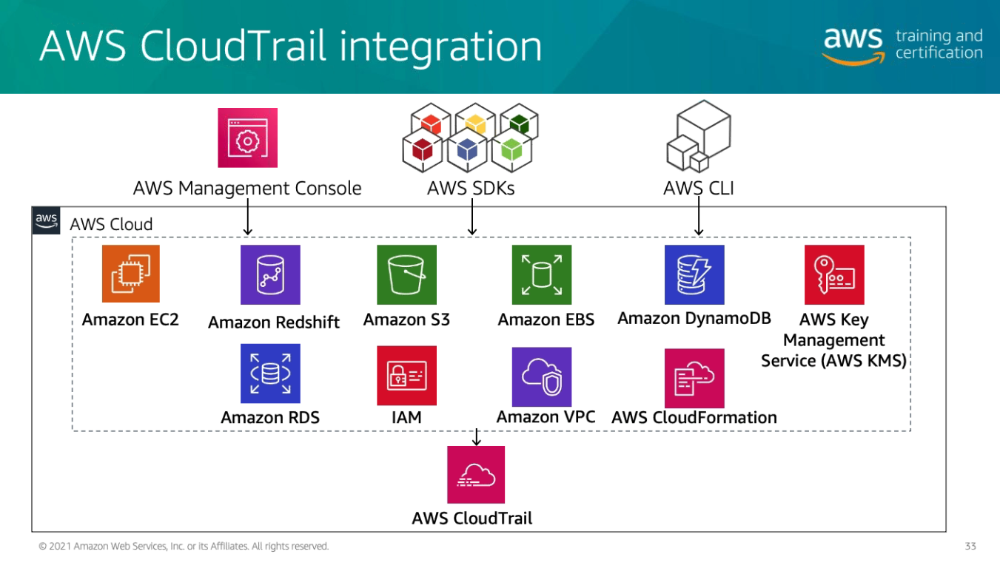
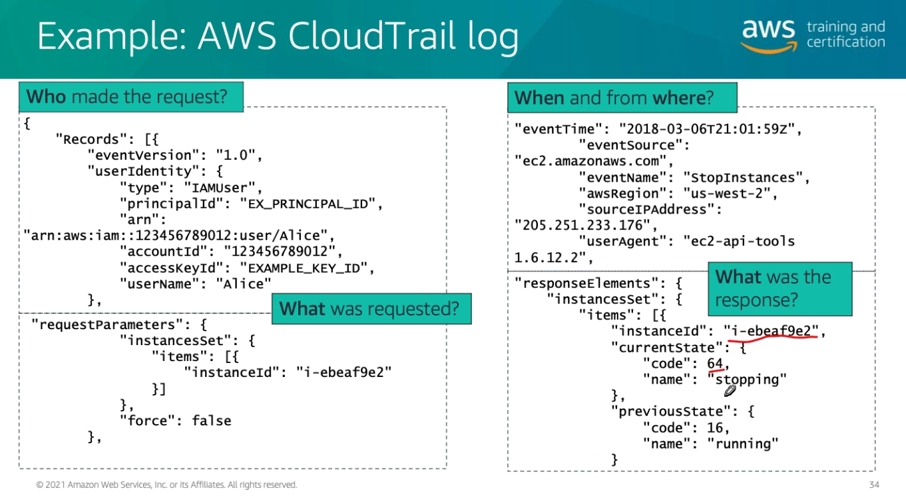

# Módulo 2

## AWS Developer 101

  

### User
 - AWS Console
 - CLI
 - SDKs

### SDK
  

- Service client API (baixo nível)
- Resource API (alto nível)

### Cloud9
- IDE Online
- Muitas funcionalidades úteis
  - Debug
  - Language
  - Environment
  - Runtime

### X-Ray

  

- Analytics 
  - Número de rotas de /create/user, por exemplo
  - Resposta
  - Status
  - Hora do requests
  - [Operações (onde você conseguir injetar a SDK)](https://docs.aws.amazon.com/xray/latest/api/API_Operations.html)

### CloudWatch
- Coletor de métricas
- Monitor de logs
- Alarmes
- Gráficos e estatísticas
- Monotirar CPU, memória, disco, rede, etc
- Reage aos logs de aplicação e eventos
- Escala automaticamente instancias EC2
- Identifica problemas

### Tríade da Escalabilidade

  

### CloudTrail
  

- Registros de chamadas de API
- Armazenar notificações nos buckets do S3

  

