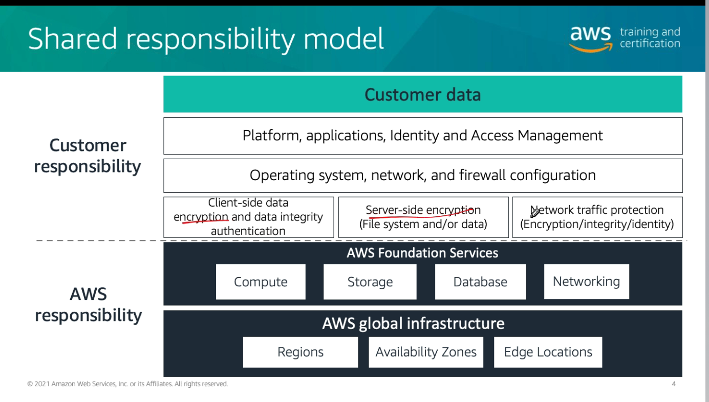
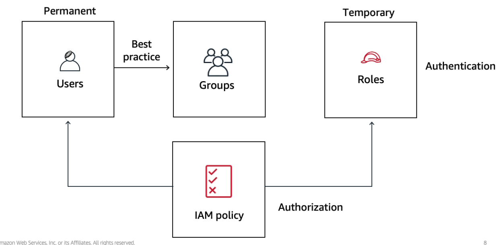
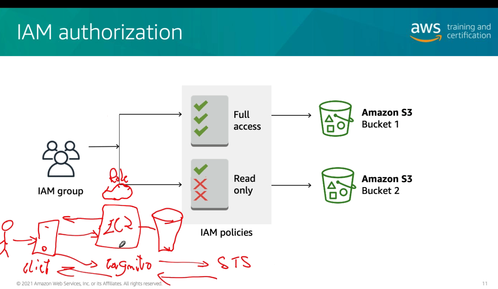
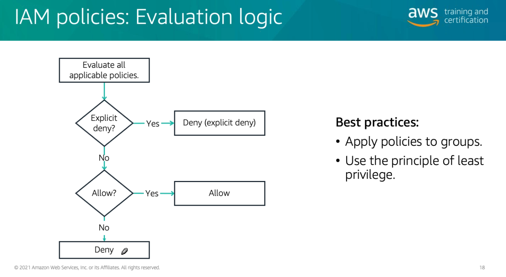
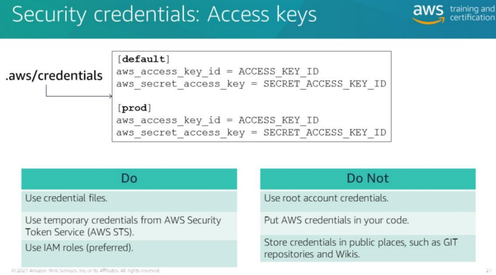

# Módulo 3

## Shared Responsibility model (AWS + Costumer)

  

- AWS disponibiliza as ferramentas para tornar a aplicação e infraestrutura segura
- O cliente utiliza os serviços e ferramentas para tornar a aplicação e infraestrutura segura

## IAM (Identity and Access Manager)

Políticas geram permissões para usuários em grupos com determinados papeis

  

- Usuários podem assumir roles (algum papel que desempenhe uma ação em recursos)

  

- Instâncias podem assumir roles para utilizar recursos

### Tipos de Permissão
- Baseados em identidade
  - Não precisa do ARN do usuário
  - Bind serviços para o usuário

- Baseados em recursos
  - Atrelada a um recurso
    - Bucket do S3
    - Instância EC2
  - Bind usuários para o serviço

  

(O NÃO você sempre tem, você busca o SIM)

## ARN (Amazon Resource Names)

- Utilizado pra identificar um recurso de maneira única na aws
  
  `arn:aws:<service>:<region>:<account>:<resource_id>`

## Autenticação

- AWS Authentication
- Resource authentication
- App authentication
- DB authentication

## Credentials
- `.aws/credentials` - arquivo de chave
- É preferível usar as ROLES
- 
  

### Algoritmo
- 1. Procura no código
- 2. Procura nas variáveis de ambiente
- 3. Procura nos arquivos de credencial
- 4. Procura nas roles da instância