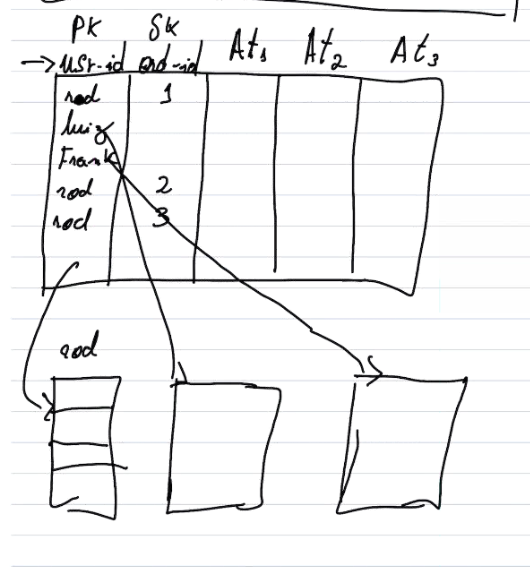

# Módulo 6

## NoSQL
  

### [OLAP vs OLTP](https://www.stitchdata.com/resources/oltp-vs-olap/)
- Bancos relacionais são melhores para operações OLAP
- Bancos não relacionais são melhores para operações VOLATILES ou TRANSITORY (OLTP)

## AWS Database Options
  

### Amazon RDS
 - Suporta diversos bancos de dados
   - SQL Server
   - MariaDB
   - Oracle
   - PostgreSLQ
   - MySQL
 - Autoscalável
 - Replicação
   - Read Replica (Worker)
   - Secondary Replica (Slave)
 - Backups por até 35 dias (mesmo deletando a instância principal)

### Amazon Aurora (Engine da AWS desenhada pra núvem)
- Postgres -> 5x mais rápido que o RDS
- MySQL -> 3x mais rápido que o RDS
- Alta disponibilidade
- Alta performance
- Alta escalabilidade
- Multiregiões

### Amazon Redshift
- Data Warehouse
- SQL Query em dados não estruturados no S3
- Suporta vários formatos
- Suporta vários BIs

### Amazon ElastiCache
- In memory data storage
- Fully managed

### Amazon Neptune
- Banco de dados em grafo
- Alcance e engajamento de perfis em redes sociais

### Amazon DynamoDB
- SGBD não relacional
- Alta disponibilidade
- Resposta de operação consistente
- Suporta documentos

#### Tabelas e Partições
- Tabelas
  - Partition Keys
  - Sort Keys (opcional)
  - Atributos

  
- Busca por SortKeys de uma PK

  

- Não é possível escolher de qual réplica consultar

#### Itens e atributos
- Key value item
- Document item

#### Modelos de consistência
- RCU (Read Capacity Unit)
  - Lê 4KB/s
  - Leitura Eventual (0.5 RCU)
  - Leitura Forte (1 RCU)
- WCU (Write Capacity Unit)

### [Amazon DMS](https://aws.amazon.com/pt/dms/)
- Schema Convertion Tool

#### Índices secundários
- Habilita queries para atributos não-chave
- Dois tipos
  - GSI (Global Secondary Index)
    - 
  - LSI (Local Secondary Index)
      
    - Troca de sort-keys
    - Chave de partição se mantém
    - Duplica a tabela, mas a segunda parte (duplicada) com o sort_key trocado com a nova chave de busca (um attribute)
    - Somente é possível criar o índice no momento de criação da tabela