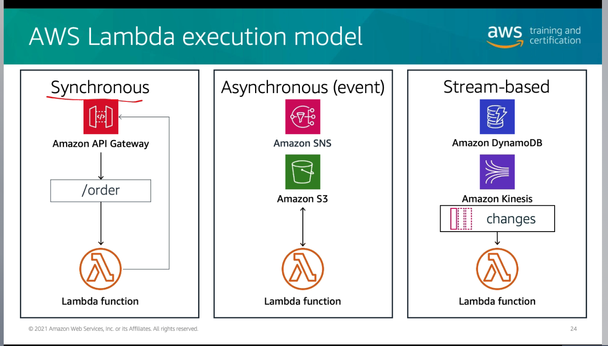

# Módulo 7

## Serverless Computing
- Não gerenciar servidor
- Escala com a utilização
- Não pagar por inatividade
- Disponível e tolerante a falhas

  

### AWS Serverless Platform

  

## AWS Lambda
- Serviço de computação serverless sem provisionar um servidor
- "FUNCTION AS A CODE"

  

- Integra nativamente com outros serviços da AWS
- Runtime [Firecracker](https://firecracker-microvm.github.io/)

  

- Variáveis de Ambiente
- Diferentes Runtime
- Ferramentas de monitoramento
- Publicação de Logs pro CloudWatch

### Execution Model
  

### Política de acesso
1. Role
2. Permissões para assumir a Role
3. Attach da permissão

### Scheduling
-   Fixar uma expressão (minuto, hora)
-   Cronjob (1/2 * * * *), qualquer combinação