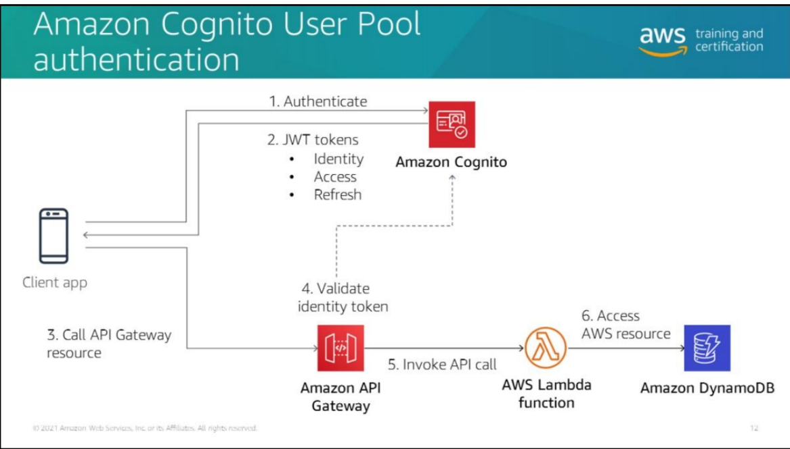

# Módulo 8

- Uma API Middleware para multiplos microsserviços
- Provém proteção a DDoS
- Autenticação e autorização para o backend
- Throttle (contagem de utilização por segundo), métricas e monetização de API
  - Travar throttle rate
  - Travar burst (http 429)

## Cognito para autenticação

  

