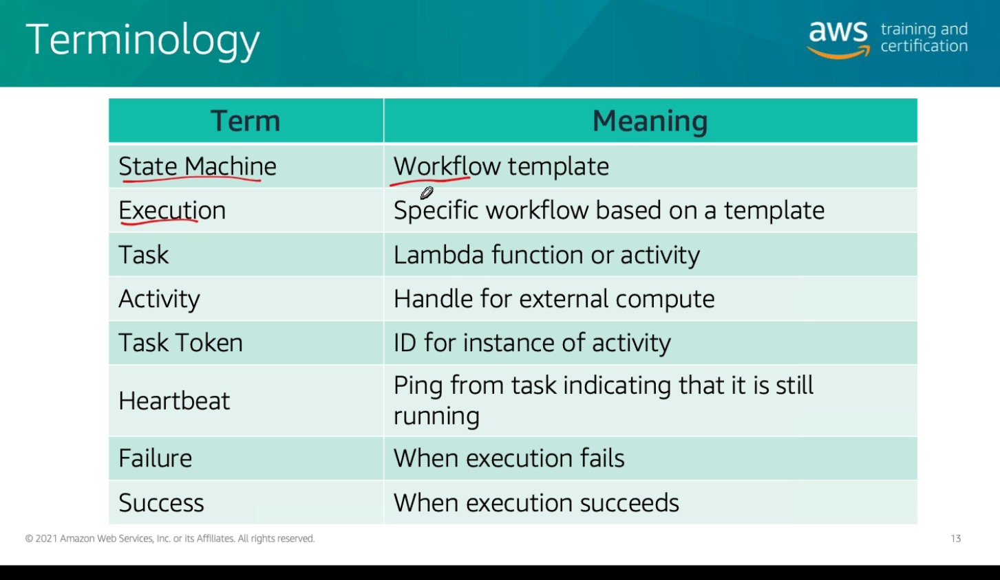

# Módulo 9
  

## Step Functions
- Motivação : retries, paralelismo. 
- Orquestrador de funções, que criam e cordenam (workflow) baseado em uma máquina de estados
- Ciclo de vida da aplicação

### Benefícios
- Produtividade
  - Construção de aplicações mais simples
- Agilidade
  - Escala e recuperação
- Adaptação
  - Evoluir aplicações facilmente

### Terminologia

  

### Amazon States Language
- Linguagem de marcação exclusiva para a definição de uma máquina de estados das StepFunctions

  

